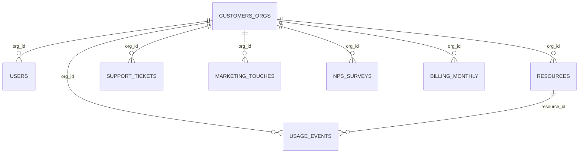

# 2. Inventario y perfil inicial de las fuentes

> Entrega 1 · Documento de diseño · Sección 2 · v0.1 (2026-09-30)
> Evidencia: `notebooks/01_exploracion_fuentes.ipynb` y `evidence/entrega1/perfil_fuentes.json`.
> Las frecuencias de llegada son **supuestos** basados en la consigna (2.1): eventos *near real-time*; maestros,
> facturación y fuentes de referencia en lotes diarios o mensuales. El dataset es una foto estática.

## 2.1 Mapa de relaciones

Todas las fuentes se conectan con el maestro de clientes por `org_id`; los eventos, además, con el maestro de recursos
por `resource_id`. Verificado: **0 huérfanos** en las 8 fuentes y consistencia total evento ↔ recurso en organización,
servicio y región.

## 2.2 Inventario

| Fuente | Dominio | Formato · tamaño | Filas | Grano (1 fila =) | Clave natural | Llegada (supuesto) | Ingesta | Período | Alimenta |
|---|---|---|---:|---|---|---|---|---|---|
| `usage_events_stream/*.jsonl` | Uso | JSONL · 120 archivos · 12,3 MB | 43.200 | una medición de una métrica de un recurso en un minuto | `event_id` | continua, en micro-lotes | **streaming** | 2025-07-03 → 08-31 | `org_daily_usage_by_service`, `cost_anomaly_mart`, `genai_tokens_by_org_date` |
| `customers_orgs.csv` | CRM | CSV · 7,6 KB | 80 | una organización cliente | `org_id` | diaria (snapshot) | batch | altas 2025-05-04 → 07-02 | dimensión de todos los marts |
| `resources.csv` | Plataforma | CSV · 35,8 KB | 400 | un recurso cloud | `resource_id` | diaria (snapshot) | batch | altas 2025-05-04 → 08-21 | enriquecimiento de eventos en Silver |
| `billing_monthly.csv` | FinOps | CSV · 15,5 KB | 240 | una factura de una organización en un mes | `invoice_id` (y `org_id`+`month`, único) | mensual | batch | 2025-06 → 2025-08 | `revenue_by_org_month` |
| `support_tickets.csv` | Soporte | CSV · 69,3 KB | 1.000 | un ticket | `ticket_id` | diaria (incremental) | batch | 2025-05-09 → 08-31 | `tickets_by_org_date` |
| `users.csv` | CRM | CSV · 69,0 KB | 800 | un usuario de una organización | `user_id` | diaria (snapshot) | batch | altas 2025-05-04 → 08-11 | gobierno (PII); sin mart obligatorio |
| `nps_surveys.csv` | Producto / CX | CSV · 3,9 KB | 92 | una encuesta de una organización en una fecha | `org_id`+`survey_date` | por encuesta (lote diario) | batch | 2025-05-24 → 08-31 | análisis opcional de satisfacción |
| `marketing_touches.csv` | Marketing | CSV · 99,6 KB | 1.500 | una interacción de campaña con una organización | `touch_id` | diaria | batch | 2025-05-04 → 08-31 | análisis opcional |

Ninguna fuente tiene duplicados sobre su clave natural. Las fuentes que alimentan consultas obligatorias
son eventos, `customers_orgs`, `resources`, `billing_monthly` y `support_tickets`; `users`, `nps_surveys` y
`marketing_touches` se ingieren a Bronze pero no son críticas para el MVP.

## 2.3 Perfil por fuente: tipos, calidad y riesgos

Tipo destino = tipo que tendrá la columna a partir de Bronze. En Landing todo se lee como texto (D-05).
Calidad: **[C]** calidad (validez, completitud, consistencia) · **[N]** condición de negocio · **[G]** gobierno.

### Eventos de uso (`usage_events_stream`)
- **Tipos destino:** `event_id`, `org_id`, `resource_id`, `service`, `region`, `metric`, `unit` → string ·
  `timestamp` → `event_ts` timestamp UTC · `value` → double · `cost_usd_increment` → double ·
  `schema_version` → int · `carbon_kg` → double (solo v2) · `genai_tokens` → long (solo v2 y `service = genai`).
- **Esquema:** v1 = 10.800 eventos (hasta 2025-07-17); v2 = 32.400 (desde 2025-07-18), agrega `carbon_kg` y `genai_tokens`.
- **Calidad:** [C] `value` nulo 877 · como texto 1.309 (todos casteables) · `unit` nulo 2.075 (imputable: metric→unit fija) ·
  costo < −0,01 en 211 · spikes > 10 × p99 en 34 · 7.371 eventos anteriores a la creación de su recurso ·
  14 colisiones de clave contextual (no son duplicados).
- **Riesgos:** llegada desordenada (cada archivo cubre ~60 días, D-04); una futura v3 de esquema; small files.

### Clientes (`customers_orgs`)
- **Tipos destino:** `org_id`, `org_name`, `industry`, `hq_region`, `plan_tier`, `sales_rep`, `lifecycle_stage`,
  `marketing_source` → string · `is_enterprise` → boolean · `signup_date` → date · `nps_score` → double.
- **Calidad:** [C] `nps_score` nulo 11 (13,8 %) · 1 fuera de [−100, 100] · **25 (31 %) con `is_enterprise`
  inconsistente con `plan_tier = enterprise`**.
- **Riesgos:** es la dimensión central: un error acá se propaga a todos los marts. Escala de NPS ambigua.

### Recursos (`resources`)
- **Tipos destino:** `resource_id`, `org_id`, `service`, `region`, `state` → string · `created_at` → date ·
  `tags_json` → array&lt;string&gt; (parseado del JSON).
- **Calidad:** [C] `tags_json` nulo 83 (20,8 %) · [G] 85 recursos (21 %) con tag `pii:true`.
- **Riesgos:** **dialecto CSV**: `tags_json` contiene comas y comillas duplicadas; sin `escape = '"'` Spark corta el
  campo (detectado y corregido en el lector). `created_at` posterior a eventos del mismo recurso (ver eventos).

### Facturación (`billing_monthly`)
- **Tipos destino:** `invoice_id`, `org_id`, `currency` → string · `month` → date (primer día del mes) ·
  `subtotal`, `credits`, `taxes` → decimal(12,2) · `exchange_rate_to_usd` → decimal(12,6).
- **Calidad:** [C] `credits` nulo 137 (57 %; supuesto = 0, D-09) · 160 facturas USD con tasa ≠ 1 ·
  montos ARS en escala USD · 50 de 80 organizaciones cambian de moneda entre meses ·
  [N] 13 subtotales negativos con impuesto positivo (D-09); taxes = 21 % de abs(subtotal), con redondeo a centavos.
- **Riesgos:** **la normalización a USD cambia la facturación un 22 %** según el criterio (D-08, inconsistencia
  intencional confirmada por el docente). Junio no tiene eventos para conciliar contra uso.

### Tickets de soporte (`support_tickets`)
- **Tipos destino:** `ticket_id`, `org_id`, `category`, `severity` → string · `created_at`, `resolved_at` → date ·
  `csat` → double · `sla_breached` → boolean.
- **Calidad:** [C] `csat` nulo 254 (25 %) · 40 fuera de [1, 5] (valores 0, 6 y 7) · 0 resueltos antes de creados ·
  [N] 240 abiertos · 56 críticos · 95 con SLA incumplido.
- **Riesgos:** fechas sin hora (granularidad diaria: no permite medir tiempos de resolución en horas).
  El CSAT promedio debe excluir nulos y valores fuera de escala.

### Usuarios (`users`)
- **Tipos destino:** `user_id`, `org_id`, `email`, `role` → string · `active` → boolean ·
  `created_at`, `last_login` → date.
- **Calidad:** [C] `last_login` nulo 139 (17 %) · **232 (29 %) con `last_login` anterior a `created_at`** ·
  [G] `email` en el 100 % de las filas (dato personal, único por usuario).
- **Riesgos:** exposición de PII si llega sin control a capas de consumo.

### Encuestas NPS (`nps_surveys`)
- **Tipos destino:** `org_id`, `comment` → string · `survey_date` → date · `nps_score` → double.
- **Calidad:** [C] `nps_score` nulo 19 (21 %) · 66 (72 %) fuera de la escala individual 0–10 · `comment` nulo 10;
  solo 60 de las 80 organizaciones tienen encuestas.
- **Riesgos:** escala no documentada; no se debe promediar con el `nps_score` de `customers_orgs` sin definirla.

### Marketing (`marketing_touches`)
- **Tipos destino:** `touch_id`, `org_id`, `campaign`, `channel` → string · `timestamp` → date
  (a pesar del nombre, solo trae fecha) · `clicked`, `converted` → boolean.
- **Calidad:** [C] 96 conversiones sin click.
- **Riesgos:** nombre de columna engañoso (`timestamp` sin hora); fuera del alcance mínimo.

## 2.4 Trazabilidad

**Trazabilidad** es poder recorrer el camino de cualquier número publicado hasta el registro y el archivo que lo
originaron. Se garantiza con cinco mecanismos:

| Mecanismo | Cómo | Dónde |
|---|---|---|
| Landing inmutable | Nunca se modifica; todo reprocesamiento parte de ahí (D-02) | Landing |
| Clave natural por fuente | Identifica cada registro de forma única (tabla 2.2) | Todas las capas |
| Columnas técnicas | `source_file` (archivo de origen) e `ingest_ts` (momento de carga) en cada fila | Bronze en adelante |
| Motivo de rechazo | Cada registro en quarantine guarda la regla que no cumplió | Quarantine |
| Linaje entre capas | Cada tabla documenta de qué tablas y con qué transformación se obtiene | Documentación / catálogo |

Ejemplo de recorrido inverso: una fila de `org_daily_usage_by_service` (org, fecha, servicio) → los eventos de
Silver que la componen → sus `event_id` y `source_file` en Bronze → la línea exacta del archivo JSONL en Landing.

## 2.5 Riesgos de datos (resumen)

Probabilidad, impacto y roles propuestos: diseño integrado, sección 7.

| # | Riesgo | Fuente | Mitigación |
|---|---|---|---|
| RD-1 | Normalización de moneda ambigua | billing | Conservar monto, moneda y tasa; opciones documentadas (D-08) |
| RD-2 | Llegada desordenada de eventos | eventos | Captura completa + dedupe/publicación incremental + reconciliación batch (D-04) |
| RD-3 | Dialecto CSV (escape de comillas) | CSV | `escape = '"'` en el lector; verificación de conteos |
| RD-4 | Columnas asignadas por posición con esquema explícito | CSV | Validar encabezados (`enforceSchema = false`) en Bronze |
| RD-5 | Nueva versión de esquema de eventos | eventos | Esquema superset + `_corrupt_record` + alerta por campos desconocidos |
| RD-6 | Escalas no documentadas (NPS, CSAT) | clientes, encuestas, tickets | Reglas de validez + supuestos documentados |
| RD-7 | Inconsistencias temporales (evento < alta del recurso, login < alta) | eventos, recursos, users | Flags de consistencia; no eliminar |
| RD-8 | Exposición de PII | users, resources | Clasificación, enmascaramiento y acceso restringido |
| RD-9 | Cobertura temporal dispar (junio sin eventos) | billing, eventos | Declarar el período conciliable (jul–ago) |
| RD-10 | Dataset sintético uniforme (720 eventos por día) | eventos | Pruebas de rendimiento no representativas: declararlo como limitación |
