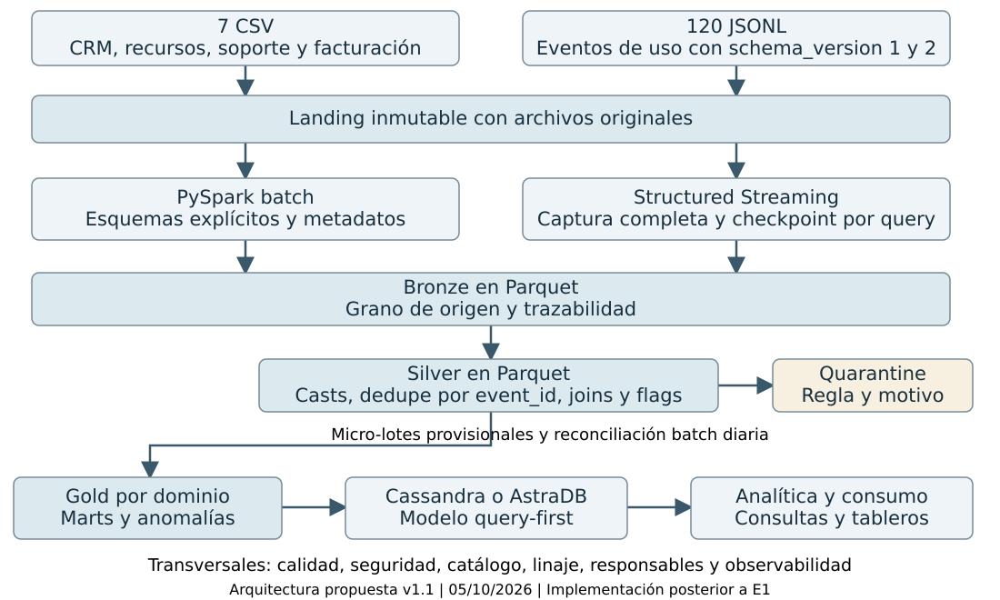

# Cloud Provider Analytics

Cloud Provider Analytics

Diseño y fundación de datos

Primera entrega · Versión 1.1 · 5 de octubre de 2026 · Prof. Diego Mosquera

Stephanie Amairany Castillo Avendaño · Gianluca Giannine Lizarraga · Agustín Ezequiel Pagani · Tomas Lautaro Reymundo · Antonio Uriel Serrano Jaimes

Proponemos una arquitectura híbrida con PySpark, Parquet y Cassandra/AstraDB para integrar consumo, clientes, facturación y soporte. Esta entrega presenta el diseño, la exploración de las ocho fuentes y una base reproducible para la implementación. Batch productivo, streaming y serving quedan planificados para las próximas instancias.

## 1 Problema y objetivos

FinOps necesita costos diarios por organización y servicio, servicios más costosos y revenue mensual. Soporte requiere tickets críticos, SLA y CSAT. Producto consulta uso, carbono y tokens GenAI. Operación necesita conocer completitud, rechazos, latencia y resultado de cada reprocesamiento.

| Objetivo | Meta propuesta | Cómo se comprobará |
| --- | --- | --- |
| O1 Completitud | 100 % clasificado como aceptado, rechazado o duplicado | Balance por fuente y run_id |
| O2 Idempotencia | 0 event_id repetidos después de replay | Conteos antes y después |
| O3 Calidad | Al menos 3 reglas con motivo y conteo | Quarantine y flags |
| O4 Frescura | Silver durable en ≤ 5 min desde arrival_ts | silver_processed_ts menos arrival_ts |
| O5 Conciliación | Costo Silver igual a Gold al mismo corte | Tolerancia de redondeo documentada |
| O6 Consumo | 2 consultas en E2 y 5 en la final | CQL y resultados en Cassandra |
| O7 Reproducibilidad | Exploración ejecutable desde entorno limpio | Notebook, perfil y versiones |

## 2 Justificación mediante las 5V

| V | Evidencia y decisión |
| --- | --- |
| Volumen | Muestra de 13,24 MB; escala productiva supuesta. Parquet, partición gruesa y compactación evitan multiplicar archivos pequeños. |
| Velocidad | El caso exige near real-time. Captura incremental y publicación en micro-lotes; la muestra no mide throughput real. |
| Variedad | Siete CSV y eventos JSONL v1/v2. Esquemas explícitos, casts y compatibilidad en Silver. |
| Veracidad | Nulos, tipos ambiguos, costos negativos y FX dudoso. Reglas, flags, quarantine y trazabilidad. |
| Valor | Marts FinOps, Soporte y Producto con granos definidos y serving orientado a consultas. |

Escala ilustrativa: 100.000 recursos × 1.440 eventos/día × 300 bytes ≈ 43,2 GB/día; 90 días ≈ 3,9 TB sin compresión. Es un supuesto para justificar escalabilidad, no una medición ni un dimensionamiento definitivo.

## 3 Inventario y perfil de las fuentes

El dataset es una foto estática. Las frecuencias siguientes son supuestos del diseño. Todas las fuentes se relacionan por org_id y los eventos también por resource_id; no se detectaron claves huérfanas.

| Fuente | Filas / campos | Grano y clave | Llegada |
| --- | --- | --- | --- |
| customers_orgs | 80 / 11 | Organización / org_id | Diaria |
| users | 800 / 7 | Usuario / user_id | Diaria |
| resources | 400 / 7 | Recurso / resource_id | Diaria |
| support_tickets | 1.000 / 8 | Ticket / ticket_id | Diaria |
| marketing_touches | 1.500 / 7 | Interacción / touch_id | Diaria |
| nps_surveys | 92 / 4 | Encuesta / org_id + survey_date | Diaria |
| billing_monthly | 240 / 8 | Factura org y mes / invoice_id | Mensual |
| usage_events_stream | 43.200 / 13 | Medición / event_id | Incremental |

Eventos: 120 JSONL, 12.927.515 bytes, del 03/07 al 31/08/2025 y 720 eventos por día. Los siete CSV suman 307.906 bytes. Billing abarca junio, julio y agosto; junio no tiene eventos para conciliar. Los 13 campos de eventos son el superset de negocio, sin contar _corrupt_record técnico.

### Tipos y evolución del esquema

La lectura inicial conserva los CSV como texto; eventos usan esquema superset defensivo. El contrato tipado prevé claves y categorías string, fechas date o timestamp UTC, booleanos de estado, value/costos/carbono double, schema_version int y genai_tokens long. Facturación usa decimal(12,2) y FX decimal(12,6); tags_json se parsea a array<string>. El diccionario completo está en 02_inventario_fuentes.md y el esquema de lectura en src/common/schemas.py.

Hay 10.800 eventos v1 y 32.400 v2. Desde el 18/07/2025 aparece carbon_kg; genai_tokens está en 3.132 eventos v2 de GenAI. En v1 los campos nuevos se conservan NULL: su ausencia no equivale a consumo cero.

### Hallazgos que condicionan el diseño

| Área | Evidencia medida | Tratamiento propuesto |
| --- | --- | --- |
| Eventos | 877 value nulos; 1.309 numéricos como texto; 2.075 unit nulos | Cast controlado; flag de faltantes; imputar unit por metric. |
| Claves y tiempo | 0 event_id duplicados; 14 colisiones contextuales; 7.371 eventos previos al alta del recurso | Dedupe por event_id; flag temporal, sin borrar observaciones. |
| Costos | 216 negativos, de ellos 211 < -0,01; 34 spikes con el umbral exploratorio | Preservar negativos y marcar anomalías; umbral final por validar. |
| Maestros y soporte | 232 logins previos al alta; 40 CSAT fuera de [1,5]; 85 recursos pii:true | Reglas de consistencia; CSAT válido; acceso y exclusión de PII de marts. |
| Billing y NPS | 13 subtotales negativos con impuestos positivos; FX de USD ≠ 1; escalas NPS ambiguas | Conservar originales; contrato contable y escalas aún abiertos. |

Trazabilidad: source_file, clave natural, versión de esquema/regla y run_id permiten recorrer un agregado de Gold hacia los eventos de Silver, su origen Bronze y el archivo original. Los hashes de los 127 archivos de Landing permiten comprobar que permanecen inmutables.

## 4 Arquitectura híbrida y flujos

El patrón híbrido combina batch diario o mensual para maestros y facturación con Structured Streaming para eventos. Una Kappa pura agrega complejidad a snapshots y cierres mensuales; una Lambda con dos implementaciones de la misma transformación aumenta el costo de mantenimiento. Compartimos la conformación de Silver y reconciliamos el histórico por batch.

Figura 1. Arquitectura propuesta v1.1, 05/10/2026. El repositorio implementa exploración; los componentes de ingesta productiva, transformación y serving están diseñados para E2 y la final.

### Flujo batch

CSV → PySpark con header, escape de comillas y esquema defensivo → Bronze tipificado → Silver normalizado y unido a dimensiones → Gold por dominio → carga en Cassandra/AstraDB → consultas. Maestros pequeños como snapshots sin particionar; SCD se incorporará si la necesidad temporal lo justifica.

### Flujo streaming y datos tardíos

JSONL → esquema superset, source_file y checkpoint por query → Bronze sin filtro temporal → Silver con casts, dedupe por event_id, joins y flags → ventanas operativas de 5 min con watermark propuesto de 24 h → Gold provisional. El batch diario reconstruye el histórico con todos los eventos conservados en Bronze.

Cada archivo mezcla casi 60 días. La simulación de un archivo por micro-lote clasifica 42.118 eventos como tardíos con 24 h. No es una prueba real de descarte de Spark. Por eso las ventanas no serán el histórico canónico; E2 comparará replay original y replay ordenado derivado, sin modificar Landing.

## 5 Contrato del Data Lake

Todas las rutas dependen de DATALAKE_ROOT, usan snake_case y fechas UTC. Las particiones se eligen por tiempo y tamaño observado; no por event_id ni por cada organización. Servicio se mantiene como columna hasta justificar otra partición.

| Zona | Grano y formato | Partición y nombre | Promoción |
| --- | --- | --- | --- |
| Landing | CSV y JSONL originales | Nombres originales | Validar manifest/hash; solo lectura. |
| Bronze | Parquet tipificado al grano de origen | events/dt=YYYY-MM-DD; maestros sin partición | Casts controlados, metadatos y balance. |
| Silver | Parquet; evento único o dimensión | usage_events/dt=...; batch pequeño sin partición | Claves, joins, nulos y flags conformes. |
| Gold | Parquet; org/día/servicio u org/mes | org_daily_usage_by_service/dt=...; revenue/month=... | Validar grano, conciliación y controles. |
| Quarantine | Parquet; registro inválido | source=.../dt=...; rule_id como columna | Revisión y replay con nueva regla. |
| Checkpoints | Estado de Spark por query | _checkpoints/query_id/ | Exclusivo por query y versión. |

### Metadatos y promoción

Desde Bronze: source_file, ingest_ts UTC, arrival_ts, run_id o batch_id y schema_version en eventos; en Silver se agrega silver_processed_ts. Catálogo por tabla con dueño propuesto, clave, grano, tipos, regla y linaje. El manifest registra archivos/hash y conteos de entrada, aceptados, rechazados y duplicados, más la salida durable.

Cast inválido o clave ausente → quarantine con rule_id, reason y origen. Unit nulo → imputación por metric y flag. Value nulo → flag, sin sumarlo como consumo conocido. Costos negativos y fechas inconsistentes → preservar y marcar. Referencia a dimensión ausente → quarantine o estado pendiente explícito. Solo se promueve si cierran balances y controles de clave.

### Idempotencia y recuperación propuestas

Parquet del prototipo requiere escritor único, staging por run_id/batch_id, manifest de lotes completados, dedupe por event_id y reemplazo controlado de las particiones afectadas. Se validará la recuperación tras fallos antes de confirmar una salida. foreachBatch y el checkpoint no garantizan por sí solos la idempotencia del destino; Parquet no tiene merge transaccional. Un formato transaccional es alternativa futura.

### Retención y archivos pequeños

Prototipo: conservar todas las zonas, manifests y evidencia hasta finalizar la evaluación, sin borrado automático. Escenario productivo a aprobar: Landing/Bronze 90 días, Silver 180 días, Gold 24 meses y quarantine 30 días desde resolución, manteniendo pendientes. Checkpoints mientras la query esté activa y 30 días tras retirarla. Revisar PII, acceso y necesidades contables antes de adoptar esta política.

Compactar por fecha al publicar y reconciliar. El objetivo futuro de 128–256 MiB por archivo es orientativo; no se fuerza sobre una muestra de 13 MB. Las dimensiones pequeñas se guardan sin particiones para evitar archivos mínimos.

### Gobierno y decisiones de negocio

Mínimo acceso, catálogo y linaje; métricas de filas, rechazos y latencia por corrida. Emails y tags personales quedan fuera de marts; las futuras credenciales se obtienen del entorno y nunca se versionan. FX, créditos e impuestos se conservan crudos. Toda estimación contable se etiqueta como provisional hasta cerrar su semántica.

## 6 Flujo batch con lógica MapReduce

Referencia: costo y requests diarios por organización y servicio, a partir de Silver conforme y previamente deduplicado por event_id.

| Etapa | Transformación conceptual |
| --- | --- |
| Map | K = (org_id, fecha UTC de event_ts, service). V = (cost_usd_increment, requests válidos si metric=requests, número de requests conocidos, cantidad de eventos). |
| Combiner | Sumas parciales por K; conservar el contador de observaciones. No mezclar requests, cpu_hours y storage_gb_hours. |
| Shuffle | Reunir todos los valores de la misma clave org, fecha y servicio. |
| Reduce | Sumar costos, requests conocidos y contadores. Si no hay requests válidos, requests=NULL. Añadir indicadores de calidad. |
| Salida | Una fila por K en org_daily_usage_by_service. Conciliar costo con Silver al mismo corte; replay no debe volver a sumar eventos. |

Equivalente PySpark: select y casts → dedupe por event_id → groupBy(org_id, fecha, service).agg(...) → validación → write Parquet por dt. La E1 exige la lógica conceptual, no un job Hadoop ejecutado.

## 7 Matriz de requisitos y componentes

Numeración de la consigna §5.2. “Diseño” identifica propuestas; “evidencia” identifica resultados de exploración ya registrados.

| N.º | Requisito | 5V | Componente | Ubicación y estado |
| --- | --- | --- | --- | --- |
| 1 | Problema y objetivos | Valor | Marts y objetivos O1–O7 | §1; evidencia futura de consultas |
| 2 | Justificación 5V | Todas | Decisiones por escala, ritmo y calidad | §2; perfil de fuentes |
| 3 | Inventario y perfil | Variedad / veracidad | Schemas, diccionario y exploración | §3; notebook y perfil JSON |
| 4 | Arquitectura completa | Todas | Fuentes a consumo y transversales | §4; arquitectura v1.1 |
| 5 | Patrón justificado | Velocidad / variedad | Híbrido batch y streaming | §4; decisión de diseño |
| 6 | Mapeo requisito y 5V | Todas | Esta matriz trazable | §7; relación requisito–componente |
| 7 | Contrato del lago | Volumen / veracidad | Zonas, Parquet, metadatos y promoción | §5; contrato propuesto |
| 8 | Flujos y herramientas | Velocidad / variedad | PySpark y Structured Streaming | §4; flujos propuestos |
| 9 | Batch MapReduce | Valor / volumen | Map, combiner, shuffle y reduce | §6; lógica conceptual |
| 10 | Supuestos y riesgos | Todas | Controles y mitigaciones | §8; DECISIONS.md |
| 11 | Esfuerzo y recursos | Todas | Roles y estimación preliminar | §8; plan inicial |
| 12 | Base de ingeniería | Todas | README, muestras, configuración | §9; repositorio y evidencia |

Los cinco artefactos de §5.3 quedan cubiertos por este documento, el repositorio, el diagrama editable, esta matriz y el plan de §8. La lista de comprobación de §9.1 de la consigna se detalla en el archivo LEER_PRIMERO_ENTREGA.txt.

## 8 Plan inicial y riesgos

Los roles son propuestos; la asignación nominal se definirá en la revisión del equipo. La estimación corresponde al cierre de E1; el esfuerzo de implementación se ajustará con el feedback y el backlog de E2.

| Trabajo | Rol propuesto | Esfuerzo | Resultado |
| --- | --- | --- | --- |
| Revisar diseño, matriz y diagrama | Arquitectura y revisión | 2 h | Documento consistente |
| Cerrar contratos y documentar dudas | Datos | 2 h | Decisiones FX, signos y escalas |
| Reproducir exploración y conservar evidencia | Ingeniería | 2 h | Notebook, log y perfil |
| Preparar explicación de flujos y MapReduce | Procesamiento y defensa | 2 h | Recorrido técnico de E1 |
| Verificar corte, acceso y envío | Representante a definir | 1 h | Constancia de recepción |

Total preliminar: 9 horas-persona de revisión y cierre. Recursos: Python 3.11, Java 17, PySpark 3.5.3, editor y almacenamiento local para ZIP/Parquet. Colab es alternativa pendiente de validar. E1 no requiere cluster ni crear una cuenta de AstraDB.

| Riesgo | Probabilidad / impacto | Mitigación | Rol propuesto |
| --- | --- | --- | --- |
| Late data | Alta / alto | Bronze completo y reconciliación histórica | Procesamiento |
| FX, créditos e impuestos | Alta / alto | Conservar originales; comparar alternativas | Datos |
| PII en consumo | Media / alto | Acceso mínimo; excluir PII de marts | Datos y gobierno |
| CSV y schema drift | Media / alto | Escape, encabezados y campos desconocidos | Ingeniería |
| Small files | Alta / medio | Partición gruesa y compactación | Arquitectura |
| Atomicidad Parquet | Media / alto | Escritor único, staging y recuperación | Procesamiento |
| Entorno o demo | Media / alto | Entorno validado, logs y notebook con salidas | Ingeniería |

Próximos pasos: incorporar feedback con prioridad, responsable, fecha objetivo y evidencia; implementar batch de al menos tres maestros y streaming; conformar Silver, tres reglas y tres features; publicar el mart FinOps y dos consultas en Cassandra/AstraDB. Watermark, atomicidad y semántica contable requieren validación en E2.

## 9 Evidencia y reproducibilidad

La evidencia versionada del 02/10 incluye notebook ejecutado, perfil y controles. El 05/10 pasaron las 19 celdas funcionales, en orden y en Python directo, con el dataset completo (43.200 eventos, 120 JSONL) y la muestra (360 eventos, un JSONL). Se usaron Python 3.11.16, Java 17.0.20.1, PySpark 3.5.3, local[2] y UTC, con EVIDENCE_DIR externo en ambos casos. Pasaron cuatro pruebas de regresión.

Límites: Colab no probado; no hay pipeline productivo. El runner Jupyter sigue bloqueado por ZeroMQ antes de ejecutar celdas. La muestra permite una prueba de humo de todas las celdas, pero carece de integridad referencial y no reproduce los totales completos. EVIDENCE_DIR admite rutas externas. Los percentiles approxQuantile pueden variar dentro de su error de rango.

Reproducción: obtener el ZIP del docente, copiar sus siete CSV y 120 JSONL a datalake/landing, instalar requirements.txt en Python 3.11 con Java 17 y ejecutar python scripts/run_exploration.py. El README incluido detalla instalación, salidas y reinicio. E2 validará streaming real, latencia, checkpoint, idempotencia y serving.

Fuentes: consigna v1.0 del 03/08/2026, §§5, 8 y 9.1; repositorio y evidencia del equipo. Procedencia del código base: commit e04b00b3078ec5d26041b849890cfe3807cbb570 de main. Las correcciones y sus resultados del 05/10 se detallan en evidence/entrega1/VERIFICACION_2026-10-05.md.

https://github.com/Sstark0/TP-BigData-CloudProviderAnalytics
